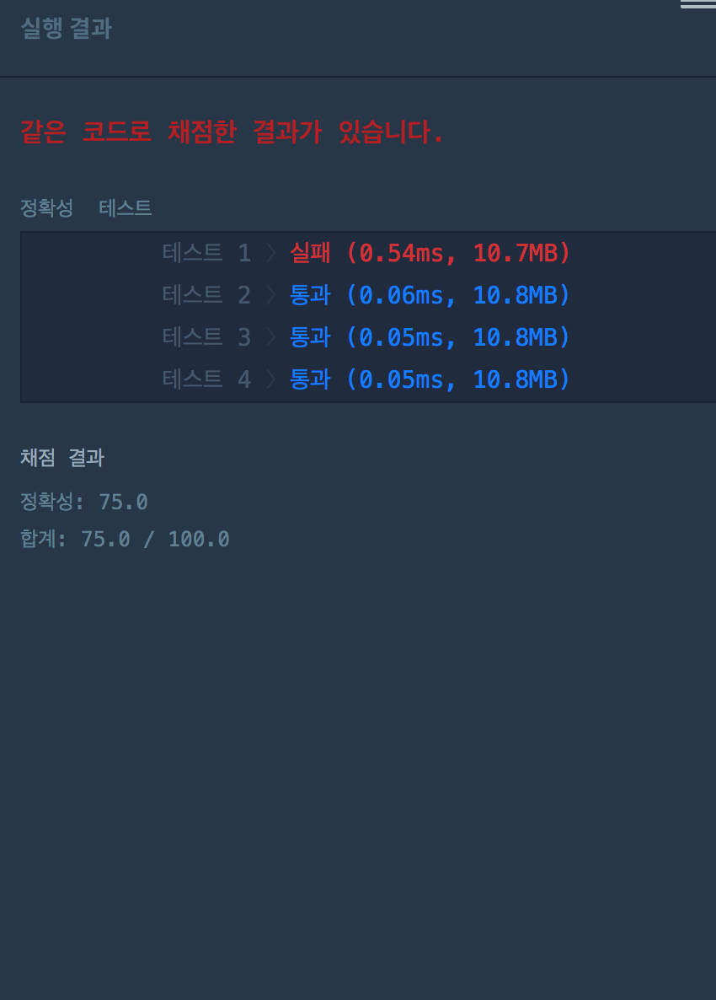
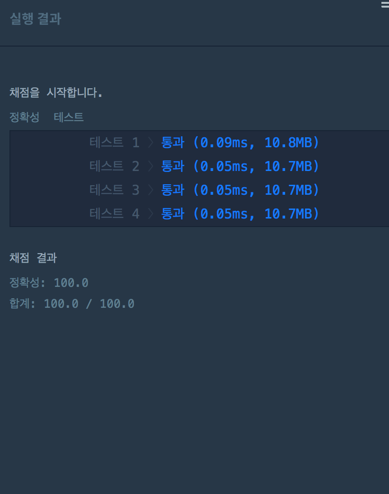

# [여행경로](https://programmers.co.kr/learn/courses/30/lessons/43164) 
> 
> 

### 코드 및 실행결과
* [실패](travel_route_tail_recursion.py) : 파이썬으로 작성한 코드  
  

* [성공](travel_route_head_recursion.py) : 파이썬으로 작성한 코드  
  

### 보충자료
* [알고리즘-공부4-한붓그리기(Eulerian-circuit)](https://sonsh0824.tistory.com/entry/%EC%95%8C%EA%B3%A0%EB%A6%AC%EC%A6%98-%EA%B3%B5%EB%B6%804-%ED%95%9C%EB%B6%93%EA%B7%B8%EB%A6%AC%EA%B8%B0Eulerian-circuit)

<!-- * [성공](TravelRoute.kt) : 코틀린으로 작성한 코드  
   -->

<!-- # [하노이의 탑](https://programmers.co.kr/learn/courses/30/lessons/17680) (?)
> 
> 

### 코드 및 실행결과
* [성공](tower_of_hanoi.py) : 파이썬으로 작성한 코드  
   -->

<!-- * [성공](Hanoi.java) : 코틀린으로 작성한 코드  
   -->

